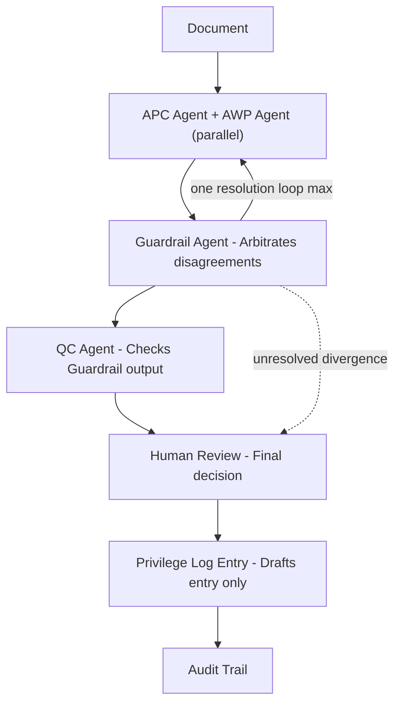

PRISM

Privilege Review Intelligence & Safeguard Matrix
AI-Augmented Privilege Review & Quality-Control System

by Lucentio Harris

🎯 Project Mission

Privilege review is one of the hardest calls to get right in document review. Reviewers either under-flag or over-flag, and either error can be costly — under-flagging risks waiver, which is often irreversible once documents are produced; over-flagging slows the case and drives up cost.
PRISM is a multi-agent system designed to run first-pass analysis and flagging on privilege calls. But handling volume isn't the same as handling the decision — the most important part of privilege coding is the human in the loop.

🛠️ Tech Stack

- Python 3.11+
- LangChain / MCP (Model Context Protocol) — agent orchestration & inter-agent messaging
- JSON Schemas — structured, auditable output for every agent recommendation
- Claude API (Anthropic) — reasoning engine for each agent
- Mermaid — pipeline/architecture diagrams

🏗️ Agent Architecture

PRISM follows a linear pipeline: a document moves forward through each stage in order and does not return to an earlier stage — with one deliberate exception. The APC Analysis Agent and AWP Analysis Agent run in parallel on every document. If their findings diverge, the Guardrail Agent analyzes the conflict and returns the case once with specific instructions for resolving it. If divergence persists after that single re-analysis, the case routes directly to Human Review rather than looping again.
Each agent is itself agentic — it observes, reasons, evaluates, and acts — but the pipeline's shape stays linear and bounded, never open-ended.

⚖️ APC Analysis Agent

Attorney-client privilege requires four elements: a communication, between attorney and client, made in confidence, for the purpose of seeking or giving legal advice. The APC Analysis Agent checks each incoming document against these four elements and returns a recommendation with its reasoning — it never makes the final call.
Example:
From: Sarah Mitchell, General Counsel
To: Daniel Roberts, Chief Financial Officer
Cc: —
Subject: Confidential — Advice Regarding Regulatory Investigation
Daniel, I am writing in my capacity as the company's attorney regarding the regulatory inquiry we received this morning. Based on the information currently available, I recommend that we do not provide the requested internal communications until we have reviewed the company's legal obligations and determined the appropriate response. Please send me the relevant correspondence and supporting documents so that I can assess our legal position and advise the company on how best to respond. This communication is intended to be confidential and for the purpose of obtaining and providing legal advice.
Sarah Mitchell, General Counsel
All four elements are met: communication between attorney (Mitchell) and client (Roberts); explicitly confidential in both subject and body; no third party copied, so confidentiality isn't broken; and the purpose — legal advice on a regulatory investigation — is stated directly rather than assumed.
Output: Privileged (APC) — confidence 94% — basis: all four elements explicitly present in text, no inference required

📁 AWP Analysis Agent

Attorney work product protects material prepared in anticipation of litigation — not just material that later becomes useful in a dispute, but material created because litigation was reasonably foreseeable at the time. Unlike APC, it doesn't require a communication between attorney and client, but it does require an actual anticipated legal fight.
Same example as above: Mitchell's email seeks to "assess our legal position" on a regulatory inquiry — no opposing party, no filed action, no case theory being built.
Output: Not work product — confidence 88% — basis: regulatory inquiry present, but no litigation-anticipation signal (no claim, no opposing party, no case theory)
Why this matters: APC and AWP are different tests. A document can pass one and fail the other. A regulatory inquiry may eventually become litigation — but "may eventually" isn't "anticipated now," and this agent is built to hold that line rather than over-flag.

🛡️ Guardrail Agent

The Guardrail Agent has two jobs:
Checks the reasoning of APC and AWP — not just their conclusions, but whether each agent correctly applied its own test.
Resolves divergence — when APC and AWP disagree, Guardrail analyzes the conflict, makes a decision, and returns the case to both agents once with specific instructions for resolving it. A single loop, capped to prevent endless back-and-forth. If the two agents still cannot converge after that one loop, Guardrail escalates directly to Human Review.
Guardrail does not re-decide privilege itself — it checks whether the two analysis agents reasoned correctly and reconciles them when they don't. That distinction matters: Guardrail is a check on the checkers, not a third vote.

🔎 QC Agent

The QC Agent does not re-review APC and AWP's original analysis — that's Guardrail's job. Instead, QC checks Guardrail's output: is the resolution Guardrail reached actually sound, is the reasoning behind it specific and defensible, and does the final recommendation hold up before it reaches a human?
This keeps the chain of accountability clean — each layer checks the one before it, rather than every layer re-doing the same work.
If QC finds Guardrail's resolution weak or unsupported, the case is flagged and passed to Human Review with QC's concerns attached — not sent back into another loop. There is only ever one loop in this pipeline (the APC/AWP divergence loop at Guardrail), so QC's disagreement becomes information for the human, not another retry cycle.

👤 Human Review Gate

Every document reaches a human before a final privilege call is made. No agent recommendation — from APC, AWP, Guardrail, or QC — is treated as final. If APC and AWP can't converge even after Guardrail's one loop, the human decides directly.
No agent may transmit anything to opposing counsel under any circumstance — that's a human-only decision, enforced explicitly in every agent's prompt.
This is the gate: AI reasons, humans decide. Privilege waiver is irreversible once produced — no system should carry that risk alone.

📋 Privilege Log Entry Agent

This agent may only draft privilege log entries after a document has been coded privileged by the Guardrail Agent or QC Agent. It has no authority to transmit, forward, produce, or share the log — or any document — with opposing counsel or any external party under any circumstance. Transmission to the other side is exclusively a human decision, made outside this agent's scope.

🔄 End-to-End Workflow

The Sarah Mitchell email arrives. APC and AWP analyze it in parallel — APC flags it privileged, AWP flags it not work product. No conflict, so it moves to Guardrail. Guardrail checks both agents' reasoning, confirms it's sound, and passes it to QC. QC checks Guardrail's output, confirms it holds, and sends it to Human Review. The reviewer sees the full trail — both agents' findings, Guardrail's check, QC's check — and approves. The Privilege Log Entry Agent drafts the log entry. Nothing is sent to opposing counsel without that human approval.

🧪 Test & Evaluation

PRISM hasn't been run against a production document set yet — this section tests its logic manually against known scenarios, the same method used to build it out.
Test 1 — Sarah Mitchell email (see full email under APC Analysis Agent)
APC = privileged (all four elements met). AWP = not work product (regulatory inquiry, litigation not yet anticipated).
Result: privileged under APC only.

Test 2 — James Okonkwo, v1 (safety bulletin)
From: James Okonkwo, in-house counsel
To: Priya Naidoo, Head of Operations
Cc: Thabo Mokoena, Operations Analyst
Subject: Warehouse safety incident — next steps
Priya, following up on the forklift incident last week. Can you send me the maintenance logs and the shift supervisor's write-up? I want to review them before we finalize the safety bulletin going out to all warehouse staff next Monday.
APC = fails (third party cc'd breaks confidence; purpose is business, not legal advice). AWP = fails (no litigation signal present, just a plausible future risk).
Result: not privileged, not work product — document should be produced.

Test 3 — James Okonkwo, v2 (litigation hold)
From: James Okonkwo, in-house counsel
To: Priya Naidoo, Head of Operations
Subject: Privileged & Confidential — Litigation Hold: Forklift Incident
Priya, we've now received formal notice from the injured worker's attorney indicating intent to file a claim. I'm preparing our litigation strategy and need your assessment of our exposure before we respond. Please do not distribute this email or discuss its contents outside Legal.
APC = privileged (attorney-client, confidential, seeking legal strategy). AWP = work product (formal claim notice received, litigation strategy explicitly being prepared).
Result: privileged under both.
What this shows: PRISM correctly distinguishes three different outcomes across three structurally similar emails — same players, same incident, different facts.

📊 Audit Trail

Every document's full path through PRISM is logged: each agent's recommendation and confidence, any Guardrail loop and its resolution instructions, QC's check, and which human made the final call. Nothing is decided invisibly.
This matters because if a privilege claim is ever challenged in court, the firm needs to show a defensible process was followed — not just that a decision was made, but that a human made it, with full reasoning behind it. The audit trail is that proof.
It also protects the reviewer: if a call turns out wrong, the record shows a human decided it, based on what the agents surfaced — not that an AI acted alone.
Internal only — the audit trail is never produced to opposing counsel. It's not the privilege log; it's the record of how PRISM reached the log.

🎨 Portfolio Note

Without formal legal training, but through months of self-directed study in privilege review, document review, and agentic AI, I designed PRISM: a system that treats disagreement between AI agents as a signal to investigate, not hide. A Guardrail Agent checks the agents' reasoning, resolves conflict where possible, and escalates to a human when it can't. Nothing is ever decided without a human in the loop.
This is a first build, not a finished product — no production testing yet, just reasoned design and manual test cases. The direction from here: more capable agentic workflows that help reviewers get privilege coding right, instead of getting it wrong.
